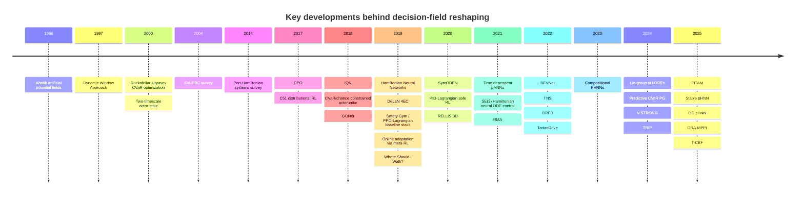

# Related Work Review for Decision-Field Reshaping

## Executive Summary

The literature most relevant to your paper falls into four streams that are usually cited separately: structured dynamics learning with Hamiltonian and port-Hamiltonian priors; safe and risk-sensitive reinforcement learning built around constraints, CVaR, or return distributions; local navigation and terrain-aware perception that convert semantics or traversability into cost maps or safety predicates; and continual or adaptive learning that updates policies or models over multiple timescales. Those streams are each mature, but they rarely meet in a single method. Hamiltonian and port-Hamiltonian learning emphasize conservation, dissipation, external ports, and energy-based control; safe RL emphasizes costs, constraints, or tail-return objectives; local navigation emphasizes reactive planners, safety filters, and traversability maps; continual learning emphasizes online or stage-wise adaptation. citeturn35view1turn34view1turn32view1turn24view0turn22view6turn24view2turn24view3turn24view4turn22view7turn36view0turn22view1turn25view2turn24view5turn24view6turn40search0

That matters because your paper’s core claim is not just “risk-aware navigation.” It is the much narrower and stronger claim that **risk should enter the policy by reshaping the closed-loop phase-space field itself**, not only by changing a planner’s external cost, a CMDP multiplier, or a return-distribution distortion. In prior work, risk is usually injected as (i) a reward/cost term or chance constraint, as in CPO, Lagrangian methods, and risk-aware MPPI; (ii) a statistic of the return distribution, as in C51 and IQN; or (iii) a traversability or semantics-derived cost map used by a downstream planner, as in BEVNet, V-STRONG, FITAM, or TNS. By contrast, classical artificial potential fields inject geometry as forces, and energy-based control injects structure into dynamics, but neither line learns **material-aware** force channels from local risk while training them with an episodic CVaR objective. citeturn22view6turn37view0turn22view5turn24view3turn24view4turn22view1turn21view4turn25view2turn21view1turn35view0turn34view1

The closest prior work to cite against your method is therefore not one single paper but a **cross-product** of papers:  
mechanistically, the closest are port-Hamiltonian learners and energy-based controllers such as DeLaN, the time-dependent pHNN of Desai and colleagues, and the SE(3)/Lie-group Hamiltonian or port-Hamiltonian neural ODE line;  
objective-wise, the closest are Rockafellar–Uryasev, Chow’s CVaR actor-critic line, and recent predictive CVaR policy gradients;  
application-wise, the closest are off-road semantics-to-cost or traversability systems such as BEVNet, V-STRONG, FITAM, TRIP, DRA-MPPI, and T-CBF. None of these individually covers the full combination of **force-level risk injection + local material perception + tail-risk optimization + multi-timescale continual adaptation**. citeturn25view1turn24view0turn25view0turn33view2turn24view1turn24view2turn23view7turn22view1turn25view2turn21view1turn12search1turn22view5turn22view4

If your NeurIPS paper has limited space, the “must-keep” references are the ones a reviewer is most likely to ask about: the pH-control line, pHNNs for dissipative/non-autonomous systems, Rockafellar–Uryasev, Chow 2018, CPO, distributional RL, Khatib/DWA/CBF, and the most relevant terrain-perception papers BEVNet, V-STRONG, FITAM, TRIP, and T-CBF. citeturn34view1turn24view0turn24view1turn24view2turn22view6turn24view3turn24view4turn35view0turn22view7turn36view0turn22view1turn25view2turn21view1turn12search1turn22view4

## Field Synthesis

A clean way to organize the related-work section is by **where risk enters the closed loop**.

In safe RL and risk-sensitive RL, risk usually enters as an **objective-space or constraint-space quantity**. Rockafellar–Uryasev gives the variational and optimization basis for CVaR; Tamar generalizes policy gradients to coherent risk measures; Chow develops both CVaR-value-iteration and CVaR/chance-constrained actor-critic methods; CPO and PID-Lagrangian update policies under CMDP-style constraints; and recent predictive CVaR policy gradients reweight contributions to a tail-sensitive objective. These methods are strong baselines for “tail-aware learning,” but they typically operate on unconstrained policy parameters rather than on a structured phase-space field. citeturn24view1turn29view0turn29view1turn24view2turn22view6turn37view0turn23view7

In distributional RL, uncertainty and risk are modeled at the **return-distribution level**. C51 argues for learning the value distribution rather than only its expectation, and IQN parameterizes the full quantile function, enabling risk-sensitive distortions over returns. This is important because reviewers may see “tail-routing” and immediately think of distributional RL; however, that line models the **distribution of returns**, not the **closed-loop force field** or the physical mechanism that generates safer paths. citeturn24view3turn24view4

In classical navigation and energy-based control, risk or feasibility can enter at the **dynamics or force level**. Artificial potential fields implement attractive and repulsive forces directly in control space, while passivity-based control and port-Hamiltonian design shape energies and damping to obtain stabilizing closed-loop behavior. This line is the closest conceptual precedent to “decision-field reshaping,” but classical APF is hand-designed and prone to well-known failure modes, while passivity-based control typically assumes an explicit analytic model and does not learn material-risk channels from local perception. citeturn35view0turn39view0turn34view1turn35view1

Perception-for-navigation papers usually stop one step earlier: they estimate semantic classes, traversability scores, or risk maps and then pass those outputs to a downstream planner or safety filter. Off-road semantic mapping, GONet, BEVNet, V-STRONG, FITAM, TNS, TRIP, DRA-MPPI, and T-CBF all fit this general pattern, even when they are sophisticated and highly practical. Your method is closest to these papers in application domain, but differs in **what is learned**: the primary learner is not just a cost map or traversability regressor, but a structured Hamiltonian decision field whose cotangent update is enriched by material-aware energy terms. citeturn21view3turn20view7turn22view1turn25view2turn21view1turn21view4turn12search1turn22view5turn22view4

This gives you a strong one-sentence positioning line for the NeurIPS paper: **prior work either learns structure without tail-risk, learns tail-risk without force-level structure, or learns traversability/risk maps that remain external to the dynamics; our method combines all three by using a single material-energy enrichment to reshape the phase-space policy flow under a CVaR-tail objective and multi-timescale continual updates.** That statement is directly supported by the literatures above. citeturn24view0turn25view0turn24view2turn22view6turn24view4turn22view1turn25view2turn22view4

## Annotated Bibliography

### Hamiltonian and port-Hamiltonian learning

**Port-Hamiltonian Systems Theory: An Introductory Overview (2014).**  
**One-sentence summary:** the canonical survey of port-Hamiltonian systems, covering modeling, dissipative elements, input-state-output ports, interconnection, and passivity. **Key technical approach:** theoretical systems-and-control framework, not a learning method. **Benchmarks:** none; this is a foundational review. **Main limitation:** no data-driven learning, no perception, and no navigation setting. **Direct comparison:** this supplies the mathematical backbone for your use of dissipative ports, external inputs, and energy-based closed-loop reasoning, but it does not tell us how to learn a material-aware risk term or adapt it episodically. citeturn35view1

**Interconnection and Damping Assignment Passivity-Based Control: A Survey (2004).**  
**One-sentence summary:** the defining survey of IDA-PBC, where one assigns a desired port-controlled Hamiltonian structure to a closed loop via energy shaping and damping injection. **Key technical approach:** analytic nonlinear control design over known models. **Benchmarks:** survey/application overview, not a common ML benchmark paper. **Main limitation:** model-based and hand-crafted; it does not learn structure from local sensor data. **Direct comparison:** your method inherits the “energy shaping + damping” intuition, but turns the added structure into a learnable, perception-conditioned, risk-aware term rather than a manually derived controller component. citeturn34view1

**Hamiltonian Neural Networks (2019).**  
**One-sentence summary:** HNNs learn a scalar Hamiltonian from data and recover dynamics via its symplectic gradient, improving generalization on conservative systems. **Key technical approach:** parameterize \(H(q,p)\), differentiate it with respect to phase coordinates, and optimize against observed derivatives. **Benchmarks:** ideal mass-spring, two-body dynamics, and pendulum image observations. **Main limitation:** autonomous and conservative; no dissipation, no control ports, no risk or navigation semantics. **Direct comparison:** your paper starts from the same structured vector-field viewpoint, but moves from conservative system identification to dissipative, externally forced, material-aware policy flows. citeturn32view1

**Symplectic ODE-Net: Learning Hamiltonian Dynamics with Control (2020).**  
**One-sentence summary:** SymODEN extends Hamiltonian learning to controlled systems and explicitly motivates model-based control synthesis through learned Hamiltonian structure. **Key technical approach:** a physics-informed ODE network that enforces Hamiltonian dynamics with control, including settings with embedded coordinates or velocity-only observations. **Benchmarks:** mechanical system learning-and-control problems. **Main limitation:** closer to system identification and energy-based control than to navigation under local semantic/material risk. **Direct comparison:** it is helpful to cite because it shows the Hamiltonian literature did move beyond pure autonomous dynamics, but it still does not inject risk into the dynamics as a learned material-energy term. citeturn32view0

**Deep Lagrangian Networks for End-to-End Learning of Energy-Based Control for Under-Actuated Systems (2019).**  
**One-sentence summary:** DeLaN 4EC learns an energy-based control representation that preserves conservation and passivity and demonstrates real-time control on physical hardware. **Key technical approach:** learn a Lagrangian representation and embed it within generic energy-based control laws. **Benchmarks:** under-actuated systems, including a physical Furuta pendulum. **Main limitation:** not a navigation or perception paper; no local semantic/material risk and no episodic tail objective. **Direct comparison:** this is one of the strongest adjacent citations because it validates the move from “black-box policy” to “energy-structured control,” but your contribution goes from energy-structured control to energy-structured **decision-field reshaping under risk**. citeturn25view1

**Port-Hamiltonian Neural Networks for Learning Explicit Time-Dependent Dynamical Systems (2021).**  
**One-sentence summary:** this paper extends HNN ideas to non-autonomous systems with dissipation and time-dependent control forces via a port-Hamiltonian neural formulation. **Key technical approach:** learn Hamiltonian, damping, and forcing terms for systems such as damped or driven oscillators. **Benchmarks:** forced/damped systems including Duffing-type dynamics and chaotic regimes. **Main limitation:** trajectory-level system identification rather than policy learning for local navigation. **Direct comparison:** methodologically, it is very close to your mechanistic story because it learns external force and damping channels, but it does not use semantic/material risk as the source of those channels and does not optimize them with CVaR across episodes. citeturn24view0

**Hamiltonian-Based Neural ODE Networks on the SE(3) Manifold for Dynamics Learning and Control (2021).**  
**One-sentence summary:** this line learns Hamiltonian rigid-body dynamics on \(SE(3)\) and couples them with energy-shaping and damping-injection control. **Key technical approach:** structure-preserving neural ODEs over configuration manifolds for stabilization and tracking. **Benchmarks:** pendulum, rigid-body, and quadrotor systems. **Main limitation:** assumes full-state robot dynamics; it is not built for partial local semantic risk or continual tail-sensitive navigation updates. **Direct comparison:** cite this when you want to show that Hamiltonian learning has already been connected to robotic control, but not yet to local material-risk reshaping. citeturn25view0

**Port-Hamiltonian Neural ODE Networks on Lie Groups for Robot Dynamics Learning and Control (2024).**  
**One-sentence summary:** the Lie-group port-Hamiltonian extension adds dissipation and manifold constraints to structured robot dynamics learning. **Key technical approach:** Lie-group pH neural ODE with explicit energy conservation, dissipation, and energy-shaping/damping control. **Benchmarks:** robot dynamics-and-control settings on Lie-group state spaces. **Main limitation:** still a full-state dynamics/control paper; the risk signal does not come from local terrain or episodic CVaR training. **Direct comparison:** among structured robotics papers, this is one of the clearest precedents for your “policy as a port-Hamiltonian flow” viewpoint, but it stops short of the risk-aware navigation regime. citeturn33view2

**Compositional Learning of Dynamical System Models Using Port-Hamiltonian Neural Networks (2023).**  
**One-sentence summary:** this work learns subsystem PHNNs and composes them using known or learned interconnection structure, with error and passivity results. **Key technical approach:** modular PHNN composition and theory for subsystem interconnection. **Benchmarks:** interacting spring-mass-damper systems. **Main limitation:** the compositional axis is subsystem synthesis, not continual adaptation of a local navigation field under risk. **Direct comparison:** useful to cite when you want to show that PHNNs support modular structural enlargement, though your “single additive material-energy term induces multiple coupled enlargements” is a different and more policy-facing enrichment principle. citeturn17search0turn23view3

**Recent robustness extensions: Stable Port-Hamiltonian Neural Networks (2025) and Port-Hamiltonian Neural Networks with Output Error Noise Models (2025).**  
**One-sentence summary:** these recent papers push PHNNs toward practical robustness, one by guaranteeing global Lyapunov stability and one by incorporating external inputs, dissipation, noise, and output-error identification. **Key technical approach:** stability-biased pH learning and noise-aware OE-pHNN identification. **Benchmarks:** illustrative nonlinear systems and system-identification benchmarks. **Main limitation:** they remain focused on model fidelity, stability, and noisy measurements rather than local perception-to-risk-to-policy reshaping. **Direct comparison:** these papers are valuable for showing the PHNN field moving toward real-world robustness, which strengthens your argument that the next missing step is **risk-aware decision-field enrichment**, not just better system ID. citeturn23view4turn33view3

### Safe and risk-sensitive reinforcement learning

**Optimization of Conditional Value-at-Risk (2000).**  
**One-sentence summary:** the foundational optimization treatment of CVaR, including the variational construction that allows VaR and CVaR to be optimized jointly. **Key technical approach:** convex/nonsmooth optimization over losses using the Rockafellar–Uryasev auxiliary function. **Benchmarks:** financial portfolio scenarios. **Main limitation:** not sequential RL and not tied to structured dynamics. **Direct comparison:** this is the mathematical root of your episodic CVaR objective; your contribution is to use CVaR not as the end of the story but as a tail-routing signal for a structured Hamiltonian learner. citeturn24view1

**Policy Gradient for Coherent Risk Measures (2015).**  
**One-sentence summary:** a unified policy-gradient treatment for static and dynamic coherent risk measures, extending beyond variance and CVaR alone. **Key technical approach:** sampling-plus-convex-programming for static coherent risk and actor-critic-style methods for dynamic coherent risk. **Benchmarks:** algorithmic/theoretical paper with risk-sensitive RL formulations. **Main limitation:** operates in generic policy-gradient space; no structured phase-space policy or local navigation. **Direct comparison:** this is the right citation to acknowledge that tail-aware RL is broader than CVaR, while also making clear that your paper does not merely swap objectives on an unconstrained policy class. citeturn29view0

**Risk-Sensitive and Robust Decision-Making: a CVaR Optimization Approach (2015).**  
**One-sentence summary:** introduces CVaR MDPs and shows that CVaR can be interpreted as robustness to worst-case model perturbations under a budget. **Key technical approach:** approximate value iteration for CVaR MDPs with error guarantees. **Benchmarks:** numerical experiments on CVaR-sensitive decision problems. **Main limitation:** value-iteration/planning oriented; not a local navigation learner and not a structured dynamics policy. **Direct comparison:** this paper is especially relevant when positioning your method against “risk as robust planning,” because your method instead lets local material risk physically deform the decision field. citeturn29view1

**Risk-Constrained Reinforcement Learning with Percentile Risk Criteria (2018).**  
**One-sentence summary:** derives policy-gradient and actor-critic algorithms for CVaR- and chance-constrained MDPs. **Key technical approach:** Lagrangian optimization with policy descent and multiplier ascent for percentile risk criteria. **Benchmarks:** optimal stopping and online marketing. **Main limitation:** risk enters as a trajectory-level constraint or objective over cumulative cost, not as a force-level modification of a structured policy field. **Direct comparison:** this is one of the most important safe-RL citations for your paper because it is closest in spirit to CVaR training, but structurally far from your “tail-routed force enrichment” story. citeturn24view2

**Constrained Policy Optimization (2017).**  
**One-sentence summary:** CPO is the standard trust-region CMDP method that enforces approximate per-iteration safety constraints during deep RL training. **Key technical approach:** constrained policy search with guarantees for near-constraint satisfaction. **Benchmarks:** simulated robot locomotion/control tasks. **Main limitation:** cost-constraint formulation, no tail-risk objective, and no structured phase-space mechanism. **Direct comparison:** cite CPO to show you are not ignoring safe RL, then argue that your contribution is orthogonal: instead of constraining an otherwise generic policy search, you enrich the underlying decision field. citeturn22view6

**Safety Gym and Safety Starter Agents (2019).**  
**One-sentence summary:** Safety Gym standardizes safe-RL evaluation, while Safety Starter Agents packages canonical baselines including PPO-Lagrangian, TRPO-Lagrangian, and CPO. **Key technical approach:** benchmark suite plus baseline implementations for constrained RL. **Benchmarks:** Safety Gym’s point/car/doggo tasks; starter agents include PPO-Lagrangian and related methods. **Main limitation:** these are benchmark-centric cost/constraint baselines, not structured dynamics methods. **Direct comparison:** this is the citation to use when reviewers ask why PPO-Lagrangian or CPO are relevant baselines; it also helps clarify that your method belongs to a different design space than generic primal-dual policy optimization. citeturn37view2turn37view3

**Responsive Safety in Reinforcement Learning by PID Lagrangian Methods (2020).**  
**One-sentence summary:** improves Lagrangian safe RL by treating the multiplier dynamics from a control perspective and adding proportional and derivative terms. **Key technical approach:** PID-style update for constraint multipliers to reduce oscillation and overshoot. **Benchmarks:** Safety Gym. **Main limitation:** still a cost/constraint-space method; the dynamics it controls are the optimizer’s multipliers, not the robot’s decision field. **Direct comparison:** useful because your paper also has multi-timescale control-like updates, but their target is not the same: PID-Lagrangian damps dual updates, whereas your loops reshape the policy-producing vector field itself. citeturn37view0

**A Distributional Perspective on Reinforcement Learning (2017).**  
**One-sentence summary:** establishes the value-distribution viewpoint and introduces a practical distributional RL algorithm. **Key technical approach:** approximate the return distribution rather than only its expectation. **Benchmarks:** Atari-57. **Main limitation:** distributional uncertainty is over returns, not environment-material risk entering control dynamics. **Direct comparison:** important to cite so reviewers do not confuse “tail sensitivity” in your work with standard distributional RL. citeturn24view3

**Implicit Quantile Networks for Distributional Reinforcement Learning (2018).**  
**One-sentence summary:** IQN learns the full quantile function of returns and supports flexible risk distortions over that distribution. **Key technical approach:** implicit quantile function approximation with quantile regression. **Benchmarks:** Atari-57. **Main limitation:** risk sensitivity is implemented by distorting quantiles of the return distribution, not by modifying the physical control field. **Direct comparison:** this is the strongest distributional-RL comparison point because it is explicitly risk-sensitive, but it still leaves the induced robot dynamics implicit. citeturn24view4

**Risk-Sensitive Policy Optimization via Predictive CVaR Policy Gradient (2024).**  
**One-sentence summary:** proposes a recent CVaR policy gradient that reweights individual cost contributions according to predicted tail contribution. **Key technical approach:** predictive reweighting for CVaR PG with minimal changes to a risk-neutral PG pipeline. **Benchmarks:** policy-optimization tasks under a CVaR objective. **Main limitation:** tail signal remains a reweighted policy-gradient correction on an unconstrained policy parameterization. **Direct comparison:** this is the closest recent comparator to your detached-quantile tail-routing story, but the route of the gradient is still “through generic policy weights,” not “through a force-channel subspace in a Hamiltonian policy flow.” citeturn23view7

### Local navigation, terrain perception, and perception-to-risk

**Real-Time Obstacle Avoidance for Manipulators and Mobile Robots (1986).**  
**One-sentence summary:** the classic artificial-potential-field paper that injects geometry directly as attractive and repulsive forces. **Key technical approach:** real-time obstacle avoidance via hand-designed potential fields, including time-varying fields for moving obstacles. **Benchmarks:** manipulators and mobile-robot experiments. **Main limitation:** hand-engineered fields and, as later work emphasized, susceptibility to intrinsic failures such as oscillatory or problematic field behavior. **Direct comparison:** this is the most important “risk-as-force” citation for your paper, because your method can be framed as learning a material-aware extension of force-field navigation rather than specifying it by hand. citeturn35view0turn39view0

**The Dynamic Window Approach to Collision Avoidance (1997).**  
**One-sentence summary:** DWA is the canonical reactive local planner that searches over admissible translational and rotational velocities. **Key technical approach:** optimize a hand-designed local objective over the dynamically reachable velocity window. **Benchmarks:** RHINO in populated and dynamic environments. **Main limitation:** geometric and short-horizon, with safety/risk entering only through an external objective. **Direct comparison:** DWA is a natural matched-information baseline because it reacts locally, but it does not learn a continuously reshaped internal force field. citeturn22view7

**Control Barrier Functions: Theory and Applications (2019).**  
**One-sentence summary:** the standard survey of CBFs for enforcing safety properties in optimization-based controllers. **Key technical approach:** safety as barrier-certified constraints over system dynamics. **Benchmarks:** survey across robotic domains. **Main limitation:** CBFs enforce safety predicates or invariant sets, but do not by themselves learn material risk, tail objectives, or closed-loop field enrichment from data. **Direct comparison:** this is the right citation when contrasting your method with “risk as safety filter.” citeturn36view0

**Real-Time Semantic Mapping for Autonomous Off-Road Navigation (2017/2018).**  
**One-sentence summary:** an early and influential demonstration that off-road navigation benefits from semantic maps richer than purely geometric maps. **Key technical approach:** maintain a 2.5D semantic map combining classes such as trail, grass, and obstacle, then plan over that representation. **Benchmarks:** autonomous ATV off-road experiments with onboard sensing. **Main limitation:** semantics remain an intermediate representation consumed by a simple planner; there is no explicit risk-sensitive objective or structured field-level adaptation. **Direct comparison:** this paper helps justify your material-aware setting, but your method learns the control field itself rather than just the semantic layer. citeturn21view3

**GONet: A Semi-Supervised Deep Learning Approach for Traversability Estimation (2018).**  
**One-sentence summary:** GONet predicts whether an observed area is traversable from fisheye RGB using largely positive examples and few negatives. **Key technical approach:** semi-supervised GAN-based traversability estimation. **Benchmarks:** new traversability datasets with roughly 24 hours of video from more than 25 indoor environments. **Main limitation:** largely indoor, binary safe/unsafe output, and no explicit coupling to a downstream structured dynamics model. **Direct comparison:** GONet is a useful perception baseline in the “semantic/traversability-to-risk” family, but your paper begins where such predictors end. citeturn20view7

**Where Should I Walk? Predicting Terrain Properties from Images via Self-Supervised Learning (2019).**  
**One-sentence summary:** learns dense terrain properties from images by projecting footholds into camera images and labeling them from force-torque signals during locomotion. **Key technical approach:** self-supervised terrain-property regression from robot-terrain interaction. **Benchmarks:** ANYmal legged robot data and navigation trials using local ground-reaction-score maps. **Main limitation:** learns terrain properties and uses them for planning, but does not embed these properties into a structured control field or optimize tail risk across episodes. **Direct comparison:** this is a strong citation for “perception-to-risk through embodiment,” and it complements your work by showing how terrain properties can be learned without manual labels. citeturn30view0

**Semantic Terrain Classification for Off-Road Autonomous Driving (2022).**  
**One-sentence summary:** formulates traversability estimation as semantic terrain classification into four cost classes and predicts a local map from sparse LiDAR. **Key technical approach:** BEVNet fuses geometry and semantics with temporal consistency to output a terrain-cost map. **Benchmarks:** on-road and off-road scenarios with strong baselines. **Main limitation:** risk is still an external local map that a planner consumes; the policy dynamics are separate. **Direct comparison:** this is one of the closest robotics comparators because it explicitly turns terrain semantics into cost classes, but your paper differs by placing risk **inside** the policy-generating dynamics. citeturn22view1

**TNS: Terrain Traversability Mapping and Navigation System for Autonomous Excavators (2022).**  
**One-sentence summary:** builds a terrain traversability map from RGB and LiDAR and integrates it into an autonomous excavation navigation stack. **Key technical approach:** learning-based semantic-geometric fusion for traversability, then planning and control over the map. **Benchmarks:** real-world excavator deployment and the Complex Worksite Terrain dataset. **Main limitation:** the traversability map is still a planning input rather than a learned force term; the risk objective is not tail-sensitive. **Direct comparison:** cite TNS to show the relevance of continuous traversability scores for planning, then emphasize that your method learns the field that uses them. citeturn21view4

**V-STRONG: Visual Self-Supervised Traversability Learning for Off-Road Navigation (2024).**  
**One-sentence summary:** a recent self-supervised method that leverages a vision foundation model and contrastive learning for off-road traversability prediction with strong OOD generalization. **Key technical approach:** image-based self-supervised traversability/costmap prediction from human driving data and segmentation masks. **Benchmarks:** a common benchmark plus diverse custom datasets, with compatibility shown for MPC. **Main limitation:** the output is still a traversability prediction or costmap used by another controller. **Direct comparison:** V-STRONG is among the strongest recent “learned perception baseline” citations for your paper. citeturn25view2

**Far-Field Image-Based Traversability Mapping for A Priori Unknown Natural Environments (2025).**  
**One-sentence summary:** FITAM learns to use far-field visual cues to predict costs beyond the robot’s local costmap horizon for better guidance in unknown terrain. **Key technical approach:** self-supervised far-field cost prediction for global planning without flat-ground assumptions. **Benchmarks:** simulated trails and real forest deployment with a Clearpath Warthog. **Main limitation:** still map-prior learning for planning, not direct learning of a closed-loop decision field. **Direct comparison:** FITAM strengthens your case that perception can reveal low-risk opportunities invisible to purely local geometry, while also making clear that your method acts one layer deeper in the control stack. citeturn21view1turn22view0

**TRIP: Terrain Traversability Mapping with Risk-Aware Prediction for Enhanced Online Quadrupedal Robot Navigation (2024).**  
**One-sentence summary:** TRIP reconstructs terrain and predicts multimodal traversability risks for online quadruped navigation. **Key technical approach:** terrain completion with risk-aware prediction under limited field of view and sparse observations. **Benchmarks:** public and in-house datasets, with onboard quadruped navigation demonstrations. **Main limitation:** risk is predicted in the map layer; the policy or planner still consumes a risk map externally. **Direct comparison:** this is one of the closest recent “risk-aware traversability” papers, so it is worth citing explicitly when distinguishing risk-map prediction from decision-field reshaping. citeturn12search1

**Dynamic Risk-Aware MPPI for Mobile Robots in Crowds via Efficient Monte Carlo Approximations (2025).**  
**One-sentence summary:** a recent local planner that computes joint collision probability under dynamic obstacles and uses risk thresholds or weighted objectives within MPPI. **Key technical approach:** Monte-Carlo approximation of chance constraints over sampled trajectories. **Benchmarks:** simulated and real-world crowd navigation. **Main limitation:** risk enters as sample rejection or weighted planning cost; the controller remains a planner over sampled actions, not a learned Hamiltonian flow. **Direct comparison:** this is the strongest recent citation for dynamic local risk handling, but it still exemplifies “risk as planning criterion” rather than “risk as force-field enrichment.” citeturn22view5

**T-CBF: Traversability-Based Control Barrier Function to Navigate Vertically Challenging Terrain (2025).**  
**One-sentence summary:** introduces a traversability-aware CBF that reasons about rollover and immobilization, not just collision avoidance. **Key technical approach:** learn observation-based traversability safety and instantiate it through neural CBFs. **Benchmarks:** simulation and real Verti-4 Wheeler experiments. **Main limitation:** learned safety filtering rather than structured force-field policy learning; no episodic CVaR optimization. **Direct comparison:** T-CBF is highly relevant because it pushes CBFs beyond geometry toward terrain safety, but it is still a safety-filter rather than a material-energy learner. citeturn22view4

### Datasets and benchmarks for terrain/material-aware navigation

**DFC2018 Houston.**  
A remote-sensing benchmark collected from an aircraft over the Houston campus area, with multispectral LiDAR, hyperspectral data with 48 bands at 1 m GSD, and 5 cm RGB imagery. **Why it matters:** it provides rich land-cover/material cues for semantic-to-risk evaluation. **Limitation relative to your paper:** it is not robotics-native and does not come with local robot traversability or risk labels; any material-risk benchmark must be derived. citeturn20view4turn25view6

**RUGD.**  
An off-road robotics dataset with 24 semantic categories including eight terrain types; public descriptions also emphasize 18 video sequences and more than 7,000 annotated frames. **Why it matters:** it is robotics-native and directly relevant to semantic terrain understanding. **Limitation relative to your paper:** it is primarily a segmentation dataset, so risk must still be mapped from semantics to material cost. citeturn27search0turn27search3

**RELLIS-3D.**  
A multimodal off-road robotics dataset with 13,556 LiDAR scans, 6,235 images, and full-stack sensor data including RGB, stereo, LiDAR, GPS, and IMU. **Why it matters:** it is the strongest real robotics complement to DFC-style semantics for your problem setting. **Limitation relative to your paper:** semantics and traversability remain intermediate labels; material-risk still must be modeled. citeturn25view5

**ORFD.**  
An off-road freespace benchmark with 12,198 LiDAR/RGB pairs across woodland, farmland, grassland, countryside, multiple weather conditions, and light conditions, with traversable/non-traversable/unreachable annotations. **Why it matters:** it is excellent for weather-conditioned freespace or traversability baselines. **Limitation relative to your paper:** the labels are coarser than nuanced material-risk classes. citeturn20view2

**TartanDrive.**  
A large-scale off-road driving dataset with roughly 200,000 interactions and seven sensing modalities, designed to benchmark model-based RL and dynamics prediction from high-dimensional observations. **Why it matters:** it is ideal if you want a dynamics-oriented off-road benchmark. **Limitation relative to your paper:** it is more naturally aligned with model learning and off-road dynamics than with semantic material-risk maps. citeturn25view7

### Continual and multi-timescale adaptation

**Actor-Critic Algorithms (2000).**  
**One-sentence summary:** the classical actor-critic paper formalizes RL updates on two timescales, with a fast critic and a slow actor. **Key technical approach:** two-time-scale stochastic approximation. **Benchmarks:** theoretical RL framework. **Main limitation:** no local perception, no structured Hamiltonian policy, and no notion of material-risk channels. **Direct comparison:** this is the best foundational citation for the idea that your three loops occupy different timescales rather than merely being three heuristics. citeturn24view5

**Finite Sample Analysis of Two-Timescale Stochastic Approximation with Applications to Reinforcement Learning (2018).**  
**One-sentence summary:** provides finite-sample theory for two-timescale stochastic approximation in RL. **Key technical approach:** lock-in probability and projection-based convergence-rate analysis. **Benchmarks:** GTD/TDC-style RL algorithms. **Main limitation:** it is theory for two-timescale SA, not a robotics adaptation method. **Direct comparison:** useful to justify the legitimacy of separated update rates in your algorithm, even though your method is more structured and application-specific. citeturn31view1

**Learning to Adapt in Dynamic, Real-World Environments through Meta-Reinforcement Learning (2019).**  
**One-sentence summary:** demonstrates online adaptation to new tasks and perturbations in simulated and real robotic environments. **Key technical approach:** meta-learn a dynamics model prior that can quickly adapt from recent experience. **Benchmarks:** continuous-control tasks and real dynamic legged millirobot experiments. **Main limitation:** adaptation is model or policy re-fitting, not structural enrichment of a closed-loop decision field. **Direct comparison:** this is a strong citation for the adaptation motivation in your introduction, while also clarifying that your method adapts **which force channels exist and how they act**, not only numeric weights in a black-box model. citeturn24view6

**RMA: Rapid Motor Adaptation for Legged Robots (2021).**  
**One-sentence summary:** achieves real-time adaptation to unseen terrains and payloads using a base policy plus an adaptation module. **Key technical approach:** fast online adaptation via latent “extrinsics” inferred from recent history. **Benchmarks:** simulation and real-world deployment across rocky, slippery, deformable, and other terrains. **Main limitation:** adaptation is latent-context conditioning of a policy, not explicit reshaping of a learned Hamiltonian decision field. **Direct comparison:** cite this when you want to show that real-time adaptation to terrain is possible, but that the mechanism in your work is structurally different. citeturn40search0

**A Survey of Continual Reinforcement Learning (2025).**  
**One-sentence summary:** a recent survey that organizes continual RL around knowledge storage and transfer across sequences of tasks. **Key technical approach:** taxonomy-and-benchmark survey of continual RL. **Benchmarks:** survey across CRL scenarios and metrics. **Main limitation:** the continual RL literature largely studies task sequences, transfer, and forgetting, rather than physical field reshaping in one navigation task family. **Direct comparison:** useful as a survey citation for your “continual” language, but the lockstep with Hamiltonian structure is still missing in that literature. citeturn14search0

## Comparison Table

The table below is optimized for a NeurIPS-related-work section. For navigation/perception papers, **Info regime** means local vs. global map access. For RL/modeling papers, it means whether the method assumes full-state or full-trajectory access rather than a local spatial sensing regime.

| Paper | Year | Method class | Info regime | Risk modeling | Benchmarks | Key limitation | How our paper improves |
|---|---:|---|---|---|---|---|---|
| *Hamiltonian Neural Networks* citeturn32view1 | 2019 | Structured vector-field learner | Full-state | Dynamics, conservative | Mass-spring, two-body, pendulum pixels | No dissipation, control, or navigation risk | Adds dissipative ports, external material forces, local sensing, and episodic CVaR training |
| *Deep Lagrangian Networks for Energy-Based Control* citeturn25view1 | 2019 | Energy-based control learner | Full-state | Dynamics/control | Furuta pendulum | No local perception or risk objective | Transfers energy/passivity ideas to local material-risk navigation |
| *Port-Hamiltonian Neural Networks for Time-Dependent Systems* citeturn24view0 | 2021 | pH system identification | Full-state/trajectory | Dynamics with dissipation and forcing | Damped/forced oscillators, Duffing | Learns dynamics, not a navigation policy | Uses pH structure as a policy flow and makes force channels risk-aware |
| *Port-Hamiltonian Neural ODEs on Lie Groups* citeturn33view2 | 2024 | Manifold-aware pH neural ODE + control | Full-state | Dynamics/control | Robot dynamics on Lie groups | Not a partial-information navigation method | Introduces local material-risk inputs and episodic tail adaptation |
| *Optimization of CVaR* citeturn24view1 | 2000 | Risk optimization theory | Full-trajectory | Cost/tail risk | Portfolio scenarios | Not sequential control or structured dynamics | Instantiates CVaR inside a structured pH learner with detached-quantile tail routing |
| *Risk-Constrained RL with Percentile Risk Criteria* citeturn24view2 | 2018 | CVaR/chance-constrained PG/AC | Full-MDP | Cost/constraint | Optimal stopping, online marketing | Generic policy gradient; no mechanism-level field shaping | Routes CVaR signal to force-channel parameters inside a Hamiltonian policy flow |
| *Constrained Policy Optimization* citeturn22view6 | 2017 | Safe RL, CMDP trust-region | Full-MDP | Constraint/cost | Simulated locomotion/control | Constraint handling without explicit tail-force mechanism | Risk affects the dynamics directly, not only the CMDP update |
| *PPO-Lagrangian / Safety Starter Agents* citeturn37view2turn37view3 | 2019 | Primal-dual safe RL baselines | Full-MDP | Constraint/cost | Safety Gym | Generic network policy, no structure | Provides a stronger mechanistic alternative under matched information |
| *PID Lagrangian* citeturn37view0 | 2020 | Safe RL multiplier dynamics | Full-MDP | Constraint/cost | Safety Gym | Damps dual variables, not policy field | Multi-timescale loops reshape the control-generating field itself |
| *A Distributional Perspective on RL* citeturn24view3 | 2017 | Distributional RL | Full-MDP | Return distribution | Atari-57 | Risk remains a return statistic | Embeds risk in dynamics rather than only in return modeling |
| *Implicit Quantile Networks* citeturn24view4 | 2018 | Quantile distributional RL | Full-MDP | Return distribution | Atari-57 | Risk via quantile distortion, not force-level control | Uses tail events to alter force channels in a structured policy flow |
| *Artificial Potential Fields* citeturn35view0turn39view0 | 1986 | Force-field local planner | Local geometry | Force | Mobile-robot and manipulator obstacle avoidance | Hand-designed fields; intrinsic failure modes and oscillation issues | Learns material-aware force channels and couples them to episodic CVaR adaptation |
| *Dynamic Window Approach* citeturn22view7 | 1997 | Reactive local planner | Local geometry | Cost/objective | RHINO in dynamic envs | Geometry-only, no learned material risk | Replaces hand-tuned objective search with a learned risk-aware decision field |
| *Control Barrier Functions: Theory and Applications* citeturn36view0 | 2019 | Safety filter / controller synthesis | Local or full-state | Dynamics constraint | Survey across robotics | Safety predicates, not risk-aware force learning | Learns material risk and tail preference, not only invariance constraints |
| *Semantic Terrain Classification for Off-Road Autonomous Driving* citeturn22view1 | 2022 | Perception-to-costmap | Local perception/map | Cost map | On-/off-road terrain scenarios | Risk remains an external map layer | Turns material risk into an internal energy term acting in the p-update |
| *V-STRONG* citeturn25view2 | 2024 | Self-supervised traversability prediction | Local RGB/local map | Cost map | Common benchmark + own datasets | Planner remains separate (e.g., MPC) | Collapses perception-to-risk and control into a single structured policy |
| *FITAM* citeturn21view1turn22view0 | 2025 | Far-field traversability mapping | Local + far-field images | Cost map | Simulated trails, real forest | Provides better planning priors, not field learning | Uses revealed low-risk opportunities to reshape the control field online |
| *TRIP* citeturn12search1 | 2024 | Risk-aware traversability mapping | Local map/point cloud | Risk map | Public + in-house quadruped data | Risk prediction still external to policy dynamics | Integrates predicted risk into the control-generating Hamiltonian field |
| *Dynamic Risk-Aware MPPI* citeturn22view5 | 2025 | Chance-constrained local planner | Local + predicted dynamics | Weighted cost / chance constraint | Simulated and real crowd navigation | Risk enters by sample rejection or weighted objective | Uses tail-risk learning to change the field itself, not just rollout scoring |
| *T-CBF* citeturn22view4 | 2025 | Traversability-aware safety filter | Local terrain observations | Dynamics constraint | Sim + real Verti-4 Wheeler | Learns safety filter, not decision-field enrichment | Couples traversability and CVaR into a structured dynamics learner |

## Timeline and Flowchart

The timeline below synthesizes the most relevant developments across force-level navigation, structured-dynamics learning, CVaR/safe RL, off-road perception, and adaptive control. It is grounded in classic APF and DWA, CVaR theory, two-timescale RL, HNN/pHNN developments, BEVNet/TNS-style terrain mapping, and the recent risk-aware traversability and planning papers such as V-STRONG, FITAM, TRIP, DRA-MPPI, and T-CBF. citeturn35view0turn22view7turn24view1turn24view5turn32view1turn25view1turn24view0turn22view1turn21view4turn25view2turn21view1turn12search1turn22view5turn22view4



The dependency map below makes the positioning argument visually explicit. The closest enabling papers are not all from one literature; the contribution emerges by **connecting** them. Hamiltonian/pH learning contributes structure; CVaR RL contributes the tail objective; local planners contribute the matched-information navigation setting; material-aware perception contributes semantic-to-risk estimation; and continual/multi-timescale learning contributes the adaptation protocol. citeturn32view1turn24view0turn24view1turn24view2turn22view7turn36view0turn22view1turn25view2turn24view5turn24view6turn40search0

```mermaid
flowchart LR
    A[Hamiltonian learning<br/>HNN, SymODEN, DeLaN] --> B[Port-Hamiltonian learning<br/>dissipation, external ports,<br/>SE(3)/Lie-group control]
    B --> O[Our method<br/>decision-field reshaping]

    C[CVaR and safe RL<br/>Rockafellar-Uryasev, Chow,<br/>CPO, PID-Lagrangian, IQN] --> O
    D[Local planners and safety filters<br/>APF, DWA, CBF, MPPI] --> O
    E[Material-aware perception<br/>semantic mapping, BEVNet,<br/>V-STRONG, FITAM, TRIP] --> O
    F[Continual and multi-timescale adaptation<br/>actor-critic, online adaptation, RMA] --> O

    O --> G[Single additive material-energy term<br/>in the p-update]
    G --> H[New force channels<br/>soft risk, barriers, lateral opportunity]
    G --> I[Detached-quantile episodic CVaR objective]
    G --> J[Three-loop adaptation<br/>local / episodic / curriculum]
```

The white space that your paper occupies is therefore precise: **it is not merely “Hamiltonian RL,” not merely “CVaR navigation,” and not merely “terrain-aware planning.” It is a structured-dynamics method in which local material risk becomes a learnable force source inside a port-Hamiltonian policy flow, and where tail risk shapes the evolution of that field through multi-timescale continual adaptation.** The literature above supports that positioning cleanly. citeturn24view0turn24view2turn22view1turn25view2turn22view5turn22view4

## Key URLs

The URLs below are prioritized toward original method papers and official dataset pages, so you can lift citations directly into a NeurIPS-related-work section.

```text
Hamiltonian / port-Hamiltonian / energy-based control
Hamiltonian Neural Networks — https://papers.neurips.cc/paper/9672-hamiltonian-neural-networks
Symplectic ODE-Net — https://openreview.net/forum?id=ryxmb1rKDS
Deep Lagrangian Networks for energy-based control — https://arxiv.org/abs/1907.04489
Port-Hamiltonian Neural Networks for Learning Explicit Time-Dependent Dynamical Systems — https://www.robots.ox.ac.uk/~sjrob/Pubs/pHNN_2021.pdf
Hamiltonian-based Neural ODE Networks on SE(3) — https://arxiv.org/abs/2106.12782
Port-Hamiltonian Neural ODE Networks on Lie Groups — https://arxiv.org/abs/2401.09520
Compositional Learning using Port-Hamiltonian Neural Networks — https://proceedings.mlr.press/v211/neary23a.html
Stable Port-Hamiltonian Neural Networks — https://arxiv.org/abs/2502.02480
Port-Hamiltonian Neural Networks with Output Error Noise Models — https://arxiv.org/abs/2502.14432
Port-Hamiltonian Systems Theory: An Introductory Overview — https://doi.org/10.1561/2600000002
IDA-PBC survey — https://doi.org/10.3166/ejc.10.432-450

Safe and risk-sensitive RL
Optimization of Conditional Value-at-Risk — https://sites.math.washington.edu/~rtr/papers/rtr179-CVaR1.pdf
Policy Gradient for Coherent Risk Measures — https://papers.neurips.cc/paper/5923-policy-gradient-for-coherent-risk-measures.pdf
Risk-Sensitive and Robust Decision-Making: a CVaR Optimization Approach — https://papers.neurips.cc/paper/6014-risk-sensitive-and-robust-decision-making-a-cvar-optimization-approach.pdf
Risk-Constrained Reinforcement Learning with Percentile Risk Criteria — https://stanfordasl.github.io/wp-content/papercite-data/pdf/Chow.Ghavamzadeh.Janson.Pavone.JMLR18.pdf
Constrained Policy Optimization — https://proceedings.mlr.press/v70/achiam17a.html
Responsive Safety in Reinforcement Learning by PID Lagrangian Methods — https://proceedings.mlr.press/v119/stooke20a.html
A Distributional Perspective on Reinforcement Learning — https://proceedings.mlr.press/v70/bellemare17a.html
Implicit Quantile Networks — https://proceedings.mlr.press/v80/dabney18a.html
Predictive CVaR Policy Gradient — https://proceedings.mlr.press/v235/kim24x.html
Safety Gym — https://openai.com/index/safety-gym/
Safety Starter Agents — https://github.com/openai/safety-starter-agents

Navigation / terrain perception / datasets
Artificial potential fields / Khatib — https://khatib.stanford.edu/publications/pdfs/Khatib_1986_IJRR.pdf
Potential field limitations — https://www.cs.cmu.edu/~motionplanning/papers/sbp_papers/integrated1/borenstein_potential_field_limitations.pdf
Dynamic Window Approach — https://publications.ri.cmu.edu/storage/publications/pub_files/pub1/fox_dieter_1997_1/fox_dieter_1997_1.pdf
Control Barrier Functions survey — https://ames.caltech.edu/ames2019control.pdf
Real-time Semantic Mapping for Autonomous Off-Road Navigation — https://www.ri.cmu.edu/app/uploads/2017/11/semantic-mapping-offroad-nav-compressed.pdf
GONet — https://cvgl.stanford.edu/gonet/
Where Should I Walk? — https://doi.org/10.1109/LRA.2019.2895390
Semantic Terrain Classification for Off-Road Autonomous Driving — https://proceedings.mlr.press/v164/shaban22a.html
TNS — https://www.roboticsproceedings.org/rss18/p049.html
V-STRONG — https://arxiv.org/abs/2312.16016
FITAM — https://robustrobotics.github.io/papers/fahnestock_ral25.pdf
TRIP — https://arxiv.org/abs/2411.17134
Dynamic Risk-Aware MPPI — https://arxiv.org/abs/2506.21205
T-CBF — https://people.cs.gmu.edu/~xiao/papers/t_cbf.pdf

Official dataset pages
DFC2018 Houston — https://machinelearning.ee.uh.edu/2018-ieee-grss-data-fusion-challenge-fusion-of-multispectral-lidar-and-hyperspectral-data/
RUGD — https://rugd.vision/
RELLIS-3D — https://www.unmannedlab.org/research/RELLIS-3D
ORFD / Off-Road Freespace Detection — https://github.com/chaytonmin/Off-Road-Freespace-Detection
TartanDrive — https://theairlab.org/tartandrive-dataset/
```
