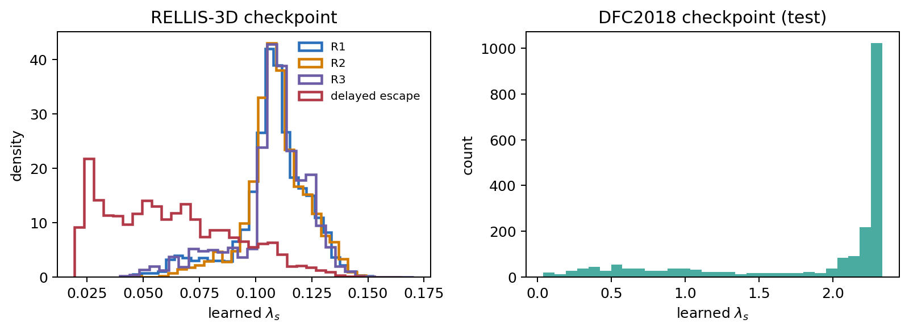

# Soft-coefficient isolation: final results

## Question and committed design

This experiment asks whether the soft-material coefficient changes behavior on
its own, without simultaneously changing the hard-hazard coefficient.

The three paired arms are:

1. **Soft off:** `lambda_soft = 0`.
2. **Learned:** `lambda_soft = checkpoint prediction`.
3. **Fixed:** `lambda_soft = 1.5` (chosen before the outcome was inspected).

In every arm, the same feasibility gate is used and `lambda_hard` and every
other network output remain the checkpoint predictions.  RELLIS-3D behavior is
evaluated on all 150 R1 episodes from validation sequence 00003; the sealed
test sequence is not used.  DFC2018 behavior is evaluated on all 30 held-out
test episodes.  The fixed gate criterion is a feasible lower-risk primitive
with at least `0.0125` lower mean ray risk, equivalent to the existing
evaluator's `0.1` summed-risk margin over eight cells.

## Trajectory-level results

Values are means; the parenthesized values are ordinary 95% CIs for the arm
mean.  Soft risk is the path-integrated risk exposure.  All arms use exactly
the same episodes and initial conditions.

| Dataset | Soft coefficient | Success | Soft risk | Mean risk/m | Path ratio |
|---|---:|---:|---:|---:|---:|
| RELLIS-3D R1 (n=150) | 0 | 1.000 | 16.7639 (0.4862) | 0.470910 (0.008126) | 0.931576 (0.004585) |
|  | learned | 1.000 | 16.7626 (0.4866) | 0.470868 (0.008138) | 0.931576 (0.004585) |
|  | fixed 1.5 | 1.000 | 16.7654 (0.4859) | 0.470962 (0.008123) | 0.931577 (0.004585) |
| DFC2018 test (n=30) | 0 | 1.000 | 10.3399 (1.3078) | 0.043092 (0.005112) | 0.926872 (0.041826) |
|  | learned | 1.000 | **10.2882** (1.3020) | **0.042861** (0.005056) | 0.926879 (0.041826) |
|  | fixed 1.5 | 1.000 | 10.2833 (1.3038) | 0.042841 (0.005062) | 0.926900 (0.041828) |

Paired comparisons are more informative than overlap between the arm-level
intervals:

- On **DFC2018**, learned minus soft-off cumulative risk is **-0.0517** with a
  paired bootstrap 95% CI of **[-0.0931, -0.0153]**.  Mean risk per metre also
  falls by **0.000230**, CI **[-0.000429, -0.000067]**.  Success remains 1.0 and
  the path-ratio change is only `+0.000007`.
- On **RELLIS-3D R1**, learned minus soft-off cumulative risk is **-0.00125**,
  CI **[-0.00374, +0.000003]**.  This is negligible and not statistically
  distinguishable from zero.  Success remains 1.0 and path ratio is unchanged.
- Learned versus fixed is not a clear win.  On DFC, the fixed arm has 0.00487
  lower risk on average (paired CI crosses zero), while learned has a path ratio
  lower by 0.000021.  On RELLIS, all differences are negligible.

The gate activates in 164/1125 RELLIS rollout stages (14.6%; 106/150 episodes)
and 619/2022 DFC stages (30.6%; all 30 episodes).

## CAR and selectivity ratio on common evaluation points

CAR is the fraction of gate-positive points where the ungated soft force has a
positive projection above `0.02` toward the best feasible lower-risk primitive.
For RELLIS, SR is mean lateral soft-force magnitude in R1 divided by R2; for
DFC, which has no R1/R2 labels, the analogous ratio is gate-positive divided by
gate-negative points.  These are force-level diagnostics on identical reference
points, not additional rollout arms.

| Dataset | Soft coefficient | CAR | SR | Positive points |
|---|---:|---:|---:|---:|
| RELLIS-3D | 0 | 0.000 | 0.000 | 268 |
|  | learned | 0.134 | 1.117 | 268 |
|  | fixed 1.5 | 0.422 | 1.161 | 268 |
| DFC2018 | 0 | 0.000 | 0.000 | 318 |
|  | learned | 0.267 | 2.606 | 318 |
|  | fixed 1.5 | 0.349 | 4.212 | 318 |

These diagnostics show that adding a nonzero soft coefficient creates a
measurable selective force.  They do **not** show that context conditioning is
better than a fixed coefficient; the fixed arm has higher thresholded CAR/SR.

## Learned coefficient distribution

| Evaluation group | n | Mean | Median | 5th--95th percentile |
|---|---:|---:|---:|---:|
| RELLIS R1 | 3444 | 0.1073 | 0.1085 | 0.0706--0.1310 |
| RELLIS R2 | 3442 | 0.1093 | 0.1090 | 0.0834--0.1327 |
| RELLIS R3 | 3357 | 0.1073 | 0.1095 | 0.0708--0.1298 |
| RELLIS delayed escape | 6334 | 0.0614 | 0.0579 | 0.0241--0.1109 |
| DFC2018 test | 2144 | 1.8132 | 2.2498 | 0.3623--2.3041 |

The RELLIS coefficient is not larger in R1 than R2/R3, so the data do not
support a claim that this checkpoint learned regime-level R1/R2/R3 coefficient
conditioning.  It is, however, substantially lower in delayed escape than in
the static RELLIS regimes (about 43% lower by the mean), which explains why the
earlier delayed-escape ablation showed almost no trajectory effect.  The DFC
checkpoint uses a much stronger soft coefficient and is also where the clean
behavioral effect appears.

## Rebuttal-safe conclusion

The clean ablation establishes a narrow but genuine independent effect of the
soft channel: on DFC2018, enabling the learned soft coefficient reduces
cumulative material risk while preserving success and path efficiency.  The
effect is small and does not reproduce materially on RELLIS R1.  Moreover, the
fixed arm shows that these results do not establish an advantage for contextual
coefficient prediction over simply including a nonzero soft force.  The rebuttal
should therefore use DFC as evidence that the soft channel is behaviorally
non-inert, while explicitly limiting the claim about learned conditioning.

## Artifacts

- `summary.json`: aggregate results and exact provenance.
- `per_episode_metrics.csv`: 540 paired episode-arm rows.
- `paired_differences.csv`: learned-minus-zero and learned-minus-fixed episode differences.
- `common_point_selectivity.csv`: CAR/SR inputs and coefficient samples.
- `rollout_coefficients.csv`: stage-level learned/used coefficients and gate decisions.
- `lambda_soft_distributions.png`: requested distribution visualization.

